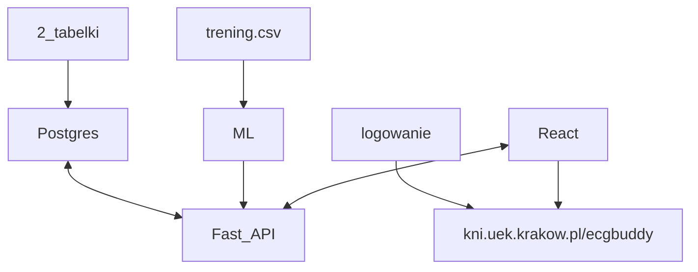

# ECG Buddy
!!! Most details relating project are in i::team Miro board !!!  
Ask MagmutC3 for access.
## basic flow

## IDE setup and other suggestions
proposed tech stack:
* https://fastapi.tiangolo.com/
* PostgreSQL
* React.js
* Pytorch:
    * PyTorch 2.0, Python >=3.8,<=3.11, CUDA 11.7,CUDNN 8.5.0.96
